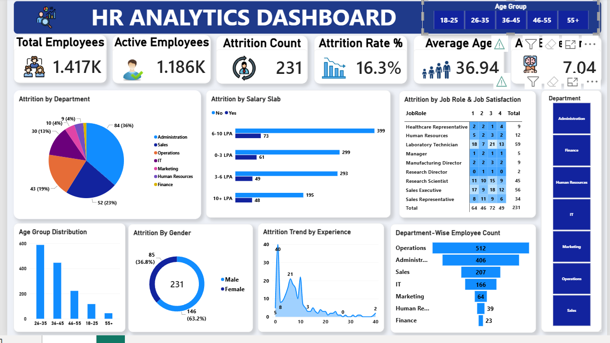

# 📊 HR Analytics Dashboard – Employee Attrition Analysis (Power BI)

An interactive **Power BI dashboard** built from employee-level HR data to understand **who is leaving, when, and why**. It covers attrition by department, salary slab, job role, age group, gender and experience, with slicers for dynamic filtering.

   

---

## 🎯 Business Problem

Employee attrition is costly: recruiting, training and lost productivity add up quickly. HR needs one place to answer:

- How many employees do we have, and what is our attrition rate?
- Which departments, salary slabs and job roles lose the most people?
- Are employees leaving early in their careers?
- Does gender, age or job satisfaction play a role?

---

## 📁 Repository Structure

```
HR-Analytics-Dashboard-PowerBI/
│
├── README.md
├── data/
│   └── HR_Analytics.csv                # Dataset used in the dashboard
├── dashboard/
│   └── HR_Analytics_Dashboard.pbix     # Power BI report file
└── images/
    └── dashboard_preview.png           # Dashboard screenshot
```

---

## 🗂️ Dataset

- **File:** `HR_Analytics.csv`
- **Size:** ~1,480 employee records and 37 columns (raw data)
- **Key columns:**
  - `EmpID`: unique employee identifier
  - `Age`, `AgeGroup`: workforce demographics
  - `Department`, `JobRole`: organisational structure
  - `MonthlyIncome`, `SalarySlab`: salary distribution
  - `Attrition`: whether the employee left the company (Yes/No)
  - `JobSatisfaction`: engagement level
  - `TotalExperience(Years)`, `YearsatCompany`: career progression

---

## 🧹 Data Preparation (Power Query)

1. Imported the CSV into Power BI Desktop and opened **Transform Data**.
2. **Checked column quality** (View → Column quality) and found about 4% empty values in `YearsWithCurrManager`. Sorted the blanks to the top and removed those **61 rows**.
3. **Checked for duplicates** using Group By and a row count, which showed repeated employee IDs.
4. **Removed duplicates using all columns** (not just `EmpID`), so only fully identical rows were deleted (2 rows). Removing by `EmpID` alone could wrongly delete valid records.
5. **Fixed spelling inconsistencies** in `BusinessTravel` using Replace Values so each category has a single consistent spelling.
6. **Corrected data types** using Transform → Detect Data Type.
7. **Added a conditional column** `AttritionCount`: 1 if `Attrition = Yes`, otherwise 0, and set it to Whole Number.
8. Clicked **Close & Apply** to load the cleaned data.

**Result:** 1,480 raw rows became **1,417 clean employee records**.

---

## 📐 KPIs & DAX

| KPI | How it is built | Value |
|---|---|---|
| Total Employees | Count of `EmpID` | **1,417** |
| Active Employees | `EmployeeCount` filtered to Attrition = No | **1,186** |
| Attrition Count | Sum of `AttritionCount` | **231** |
| Attrition Rate % | DAX measure (below) | **16.3%** |
| Average Age | Average of `Age` | **36.94 years** |
| Average Experience | Average of `YearsatCompany` | **7.04 years** |

**DAX measure:**

```DAX
Attrition Rate % = DIVIDE(SUM('HR_Analytics-4'[AttritionCount]), SUM('HR_Analytics-4'[EmployeeCount]), 0)
```

`DIVIDE` divides total leavers by total employees. The last argument `0` is the alternate result, so Power BI returns 0 instead of an error if the denominator is zero.

---

## 📊 Dashboard Visuals

| Visual | Fields used | What it shows |
|---|---|---|
| KPI Cards (6) | See KPI table | Headcount, attrition and demographic summary |
| Attrition by Department (Donut) | `Department`, `AttritionCount` | Which departments have the most leavers |
| Attrition by Salary Slab (Clustered Bar) | `SalarySlab`, count of `EmpID`, `Attrition` | Leavers vs stayers in each salary band |
| Attrition by Job Role & Job Satisfaction (Matrix) | `JobRole`, `JobSatisfaction`, `AttritionCount` | Attrition by role and satisfaction level, with colour scale |
| Age Group Distribution (Stacked Column) | `AgeGroup`, `EmployeeCount` | Workforce age profile |
| Attrition by Gender (Donut) | `Gender`, `AttritionCount` | Male vs female attrition |
| Attrition Trend by Experience (Area) | `TotalExperience(Years)`, `AttritionCount` | At what experience level people leave |
| Department-Wise Employee Count (Funnel) | `Department`, count of `EmpID` | Headcount by department |
| Slicers (Tile style) | `Department`, `AgeGroup` | Interactive filtering across the report |

**Design:** custom header with logo, consistent rounded cards (12px) with shadows, icons on KPI cards, and Format Painter for consistent styling across all charts.

---

## 🔍 Key Insights

1. **Overall attrition is 16.3%**: 231 of 1,417 employees have left.
2. **Administration has the most leavers (84, about 36% of all attrition)**, followed by Sales (52) and Operations (43).
3. **Sales has the highest attrition *rate* (~25%)**, versus Operations at only ~8%. Operations is the largest department (512 employees), so its low rate helps keep the overall figure down. *(Rate = department leavers ÷ department headcount.)*
4. **Attrition is highest early in the career.** The trend peaks at roughly **1 year of experience (40 leavers)** and drops steadily afterwards.
5. **The 10+ LPA slab has the highest attrition rate (~20%)**, so higher pay alone does not guarantee retention.
6. **Male employees account for 63.2% of attrition** (146) and female employees 36.8% (85).
7. **Laboratory Technicians (59) and Sales Executives (56)** are the roles with the most leavers.
8. **The workforce is young:** the 26–35 age group is the largest, followed by 36–45.

---

## 💡 Recommendations

- Strengthen **onboarding and first-year check-ins** to reduce early exits.
- Investigate **Sales and Administration** through exit interviews and manager feedback.
- Review **career growth and role satisfaction** for higher-paid employees (10+ LPA), not just compensation.
- Track **job satisfaction** in high-attrition roles such as Laboratory Technicians and Sales Executives.

---

## 🛠️ Tools Used

- **Power BI Desktop**: report design, visuals, slicers
- **Power Query**: data cleaning and transformation
- **DAX**: Attrition Rate % measure
- **CSV**: source data

---

## ▶️ How to Open This Project

1. Download `dashboard/HR_Analytics_Dashboard.pbix`
2. Open it in **Power BI Desktop** (free from Microsoft)
3. If the data source shows an error: **Home → Transform data → Data source settings → Change Source**, and point it to `data/HR_Analytics.csv`

---


## 👩‍💻 Author

**Ankita Kumari**
B.Com (Finance) | Aspiring Data Analyst
Skills: SQL · Excel · Power BI · Data Cleaning

- 🔗 GitHub: [ankita77-ui](https://github.com/ankita77-ui)
- 📧 ankitatube77@gmail.com

⭐ If you found this project useful, feel free to star the repository!
